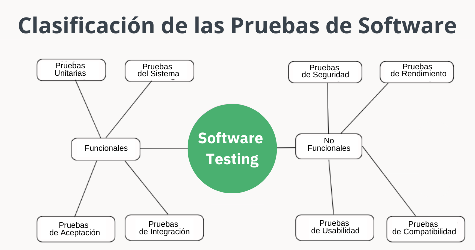

# Requerimientos.

## Funcional
### Autenticación de Usuario
Implementa un sistema de inicio de sesión que requiere credenciales únicas para acceder. Esto asegura la privacidad y seguridad de la información del paciente.

Al mantener registros médicos nutricionales de pacientes es crucial mantener seguros estos datos.

## No funcional
### Compatibilidad multiplataforma
El software debe ser capaz de funcionar en diferentes sistemas operativos, asegurando la versatilidad y accesibilidad a través de varias plataformas.

Este es el motivo por el que elegimos el modelo de aplicación web para nuestra app, así los profesionales pueden tener acceso a los registros desde cualquier lugar usando dispositivo que cuente con internet.

## Verificación de requerimientos
La verificación de los requerimientos funcionales y no funcionales durante la fase de pruebas se realiza de la siguiente manera:

- **Pruebas Funcionales**: Se enfocan en verificar que el software cumpla con las **funciones específicas** descritas en los requerimientos. Esto incluye pruebas de caja negra, pruebas de aceptación del usuario y pruebas de regresión para asegurar que todas las funcionalidades se ejecuten correctamente.

- **Pruebas No Funcionales**: Evalúan aspectos como **rendimiento**, **seguridad**, **usabilidad** y **compatibilidad**. Se realizan pruebas de carga para evaluar el rendimiento bajo condiciones de estrés, pruebas de seguridad para identificar vulnerabilidades y pruebas de usabilidad para garantizar una experiencia de usuario adecuada.

- **Revisión de Requerimientos**: Antes de las pruebas, se realiza una **revisión detallada** de los requerimientos para asegurarse de que sean claros, completos y testables. Esto ayuda a definir los criterios de aceptación para las pruebas.

- **Herramientas de Pruebas**: Se utilizan **herramientas especializadas** para automatizar pruebas, gestionar casos de prueba y rastrear defectos, lo que facilita la verificación de los requerimientos a lo largo del proceso de pruebas.